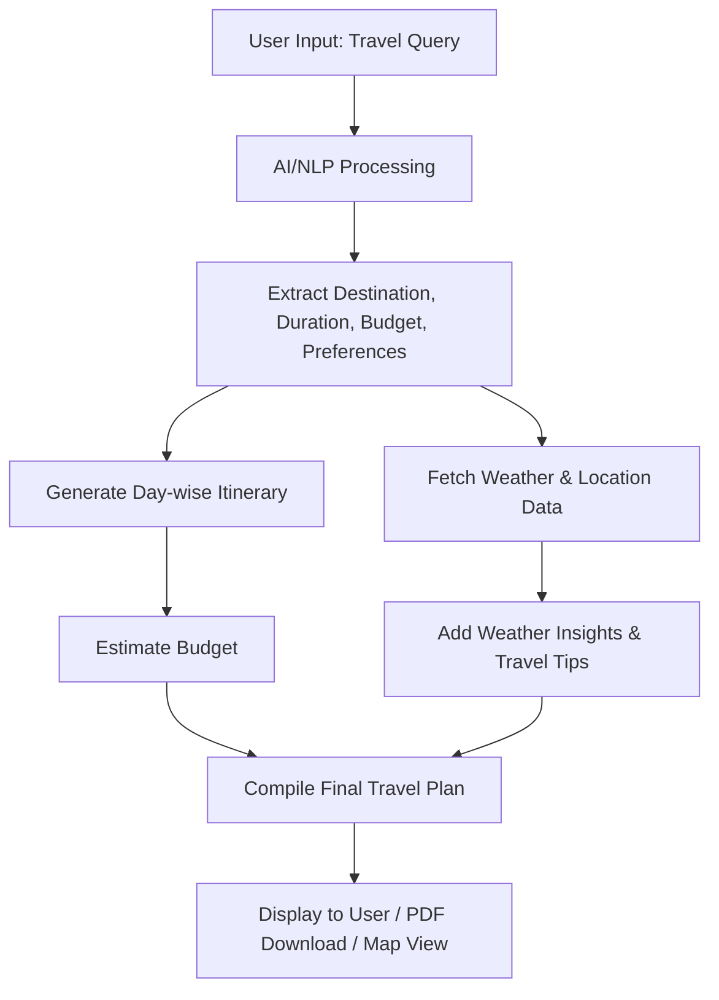

# TripGenie

TripGenie is an ASP.NET MVC web application that leverages AI-powered natural language processing to generate personalized travel itineraries, estimated budgets, weather insights, and activity suggestions. Users can type simple queries like:

> Plan a 3-day trip to Ooty for ₹10,000 with waterfalls and tea estates

and the system will automatically generate a day-wise travel plan with cost breakdown and travel tips.

## Features
- AI-powered itinerary generation
- Estimated budget calculation
- Weather insights
- Activity suggestions

## Getting Started
1. Build and run the project using Visual Studio or `dotnet run`.
2. Enter your travel query on the homepage.
3. View your personalized travel plan.

## Input
User provides travel request in natural language, including:
- Destination (e.g., Ooty, Goa, Manali)
- Duration (number of days)
- Budget (optional)
- Preferences (activities like waterfalls, beaches, adventure, local food)

**Example Inputs:**
- “Plan a 3-day trip to Ooty for ₹15,000 including tea estates and waterfalls.”
- “Weekend trip to Goa for 2 people with beaches and nightlife under ₹20,000.”

## Output
The system generates an AI-powered travel plan including:
- Day-wise itinerary with suggested activities and timings
- Estimated budget breakdown (travel, hotel, activities)
- Weather forecast & travel tips
- Optional: PDF itinerary download & map view of locations

**Example Output:**

TripGenie Travel Plan – 3 Days Ooty (Budget ₹15,000)
Day 1:
  Morning: Check-in at hotel & breakfast (₹2,000)
  Afternoon: Visit Pykara Waterfalls & boat ride (₹500)
  Evening: Explore Ooty local market
Day 2:
  Morning: Tea Factory & Doddabetta Peak (₹200)
  Afternoon: Tea estate photography tour (₹1,000)
  Evening: Relax at hotel
Day 3:
  Morning: Rose Garden & Botanical Garden (₹300)
  Afternoon: Check-out & return journey
Estimated Cost: ₹14,800
Weather: 18°C – Carry a jacket and umbrella

## Workflow Diagram

## Next Steps
- Integrate OpenAI API for NLP
- Add weather API integration
- Enhance UI/UX

---
For workspace-specific Copilot instructions, see `.github/copilot-instructions.md`.
